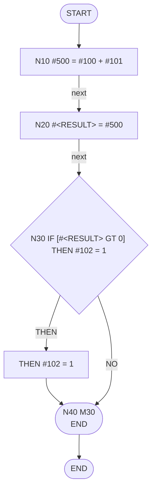

# NC Macro Visualizer

NC Macro Visualizer は、FANUC 系の NC マクロを人間が読みやすい形に変換するための読解支援ツールです。

このツールの目的は「NCマクロを初心者でも理解できる一般的なプログラムフローチャートへ翻訳すること」です。NCコードの接続関係そのものではなく、「何をしている処理か」を主役にします。NC プログラムの実行、加工シミュレーション、工具軌跡生成、実機動作保証は行いません。

## Web Demo

CLIを使わずに試せる宣伝・体験用のWebデモを用意しています。主対象は、NC初学者、経験の浅い人、PC操作があまり得意でない現場作業者です。

- [Webデモで試す](web/index.html)
- [LPを見る](lp/index.html)
- [v0.3.0 PAD図風表示サンプルを見る](examples/v030_pad_sample/pad.html)

WebデモはGitHub Pagesで動く静的HTML/CSS/JavaScriptです。大きなボタンで「NCファイルを選ぶ」「解析する」「結果を保存する」を操作し、構造図、詳細CFG、テキスト版、値のつながり、機械動作、注意点を1ページで確認できます。

Webデモは完全なPython解析エンジンの移植ではありません。出力項目名は `analysis.json` に寄せていますが、正確な解析や開発用途では下記のCLIを使用してください。

## v0.3.0 Development Theme

Mermaid風の矢印フローチャートを主役から外し、PAD図の考え方を参考にした、上から下に読める構造化表示を初心者向けの主表示にします。内部解析では Control Flow Graph (CFG) を明示的に持ちますが、CFG は詳細表示・検証用のモデルとして扱います。

PAD図風表示では、N番号を現場で使う識別子としてタイトル先頭に表示します。ただし N番号だけでは意味が伝わらないため、`N10: 値を計算する` のように処理の説明と併記します。N番号がない行は `line N` を代替表示します。

優先順位:

1. 構造図ビュー
2. テキスト版ビュー
3. 詳細CFGビューの補助化
4. やさしい用語への変換
5. 注意点の分かりやすい表示

## Status

- Package version: `v0.1.0`
- Refactor target: `v0.3.0`
- Scope: MVP stage 1 complete, structured diagram refactor in progress
- Interface: Web demo for trial, CLI for developers
- Primary outputs:
  - Markdown report: `report.md`
  - Structured JSON: `analysis.json`
  - Mermaid flowchart: `flow.mmd`
  - Beginner flow JSON: `beginner_flow.json` with `--beginner`
  - Nassi-Shneiderman HTML: `nassi_shneiderman.html` with `--nassi`
  - Structured text: `structured_text.md` with `--text`
  - PAD-inspired HTML: `pad.html` with `--pad-html`
  - PAD-inspired text: `pad.txt` with `--pad-text`
  - CFG JSON: `cfg.json` with `--cfg`

## What This Tool Does

- NC マクロ内の `N` ラベルを抽出します。
- `#100` や `#<RESULT>` のような変数を抽出します。
- 変数の代入、参照、出現回数を整理します。
- 代入式から行単位の変数依存を抽出します。
- `IF ... GOTO`、`GOTO`、`IF ... THEN`、基本的な `WHILE ... DO` / `END` を検出します。
- `M98`、`G65` のサブプログラム / マクロ呼び出しを検出します。
- 一般的な M コードには共通説明を付けます。
- 未解決 `GOTO`、重複ラベル、未対応拡張子を warning として出力します。
- Mermaid 形式で読解用の処理フローを出力します。

## What This Tool Does Not Do

- 実機での動作を保証しません。
- NC プログラムを実行、エミュレート、検証しません。
- 加工結果、工具軌跡、干渉、衝突、サイクルタイムを推定しません。
- 機械固有 M コードの意味を推測しません。
- `unknown` と判定した M コードを勝手に解釈しません。
- コントローラごとの方言差を完全には吸収しません。

詳細は [limitations.md](limitations.md) を参照してください。

## Developer CLI

CLIは開発者向け操作です。ローカルでサンプルや実ファイルを解析し、`report.md`、`analysis.json`、`flow.mmd` を生成できます。一般ユーザー向けの入口はWebデモです。

### Install

Python 3.10 以上を想定しています。

```bash
python3 -m venv .venv
.venv/bin/python -m pip install -e ".[test]"
```

依存ライブラリなしでも CLI 本体は動きます。`pytest` はテスト用の optional dependency です。

### Usage

```bash
python3 nctool.py samples/04_variables.nc -o output
```

生成物:

```text
output/
├─ report.md
├─ analysis.json
└─ flow.mmd
```

初心者向けWeb表示用のJSONを追加で生成する場合:

```bash
python3 nctool.py samples/04_variables.nc -o output --beginner
```

追加生成物:

```text
output/
└─ beginner_flow.json
```

構造図HTMLとテキスト版を追加で生成する場合:

```bash
python3 nctool.py samples/04_variables.nc -o output --nassi --text
```

追加生成物:

```text
output/
├─ nassi_shneiderman.html
└─ structured_text.md
```

v0.3.0 の PAD図風表示、テキスト版、CFG JSON を追加で生成する場合:

```bash
python3 nctool.py samples/04_variables.nc -o output --pad-html --pad-text --cfg
```

既存出力を含む全ビューをまとめて生成する場合:

```bash
python3 nctool.py samples/04_variables.nc -o output --all-views
```

## Sample Input

`samples/04_variables.nc`:

```nc
%
O1004
N10 #500 = #100 + #101
N20 #<RESULT> = #500
N30 IF [#<RESULT> GT 0] THEN #102 = 1
N40 M30
%
```

サブプログラム / マクロ呼び出しの代表例:

```nc
%
O1003
N10 M98 P2000
N20 G65 P3000 A1.0 B2.0
N30 M30
%
```

## Output Example: flow.mmd



## Output Example: analysis.json

抜粋:

```json
{
  "source_name": "04_variables.nc",
  "line_count": 7,
  "variable_summary": [
    {
      "name": "#100",
      "assignments": [],
      "references": [3],
      "count": 1
    },
    {
      "name": "#500",
      "assignments": [3],
      "references": [4],
      "count": 2
    }
  ],
  "controls": [
    {
      "line_no": 5,
      "kind": "IF_THEN",
      "target": null,
      "condition": "[#<RESULT> GT 0]",
      "text": "N30 IF [#<RESULT> GT 0] THEN #102 = 1"
    }
  ],
  "variable_dependencies": [
    {
      "line_no": 3,
      "target": "#500",
      "sources": ["#100", "#101"],
      "text": "N10 #500 = #100 + #101"
    },
    {
      "line_no": 4,
      "target": "#<RESULT>",
      "sources": ["#500"],
      "text": "N20 #<RESULT> = #500"
    }
  ],
  "warnings": []
}
```

## Output Example: report.md

抜粋:

```markdown
# NC Macro Visualizer Report: 04_variables.nc

## Summary

- Lines: 7
- Labels: 4
- Variables: 7
- IF/GOTO/WHILE/THEN: 1
- M codes: 1
- Calls: 0
- Warnings: 0

> This report is for understanding NC macro assets. It does not guarantee real machine behavior.

## Variable Dependencies

| Line | Target | Sources | Code |
| ---: | --- | --- | --- |
| 3 | `#500` | `#100`, `#101` | `N10 #500 = #100 + #101` |
| 4 | `#<RESULT>` | `#500` | `N20 #<RESULT> = #500` |
```

## M Code Policy

M コードは機械や PMC、ビルダー設定に強く依存します。

NC Macro Visualizer は、一般的な M コードに限って共通説明を付けます。未知の M コードは `unknown` / `machine_specific` として扱い、意味を推測しません。

## Tests

```bash
python3 -m unittest discover -s tests
```

`pytest` を導入している環境では次でも実行できます。

```bash
.venv/bin/python -m pytest
```

## Documentation

- [Landing Page](lp/index.html)
- [Web Demo](web/index.html)
- [v0.2.0 Refactor Instructions](docs/claude_code_v0.2_refactor_instructions.md)
- [v0.3.0 Nassi-Shneiderman Plan](docs/v0.3_nassi_shneiderman_plan.md)
- [Beginner Flow Schema](schemas/beginner_flow.schema.json)
- [Design Philosophy](docs/design.md)
- [Limitations](limitations.md)
- [Changelog](CHANGELOG.md)
- [Release Notes v0.1.0](RELEASE_NOTES_v0.1.0.md)
- [License](LICENSE)

## Landing Page Preview

ブラウザで [lp/index.html](lp/index.html) を開くと、宣伝用LPを確認できます。

Webデモは [web/index.html](web/index.html) を開くと確認できます。`lp/demo/` は v0.2.0 移行期間中の旧デモとして残しています。

ローカルサーバーで確認する場合:

```bash
python3 -m http.server 8000
```

その後、LPは `http://localhost:8000/lp/`、Webデモは `http://localhost:8000/web/` を開いてください。
